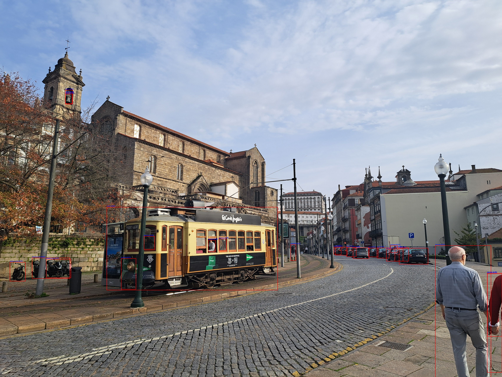

# D-FINE on ONNX Runtime

This repository contains the code to run the D-FINE object detection model using ONNX Runtime in a Node.js environment. 
The script processes an input image, performs inference to detect objects, and saves the image with bounding boxes
drawn around the detected objects.



By default, it is using [D-FINE L ob2coco_e25](https://huggingface.co/onnx-community/dfine_l_obj2coco_e25-ONNX)

## Prerequisites

*   [Download](https://huggingface.co/models?search=onnx%20dfine) any D-FINE model in ONNX format (e.g., `model_lg.onnx`) and place it in the project root directory.
## Usage

Run the script from your terminal, providing an optional path to an image file. If no path is provided, it will use a default image.

```bash
node run.mjs [path/to/your/image.jpg]
```

For example:
```bash
node run.mjs my_test_image.jpg
```

The script will process the image and save the output as `onnx_result.jpg` in the project's root directory.

## How It Works

1.  **Load Model**: The script initializes an ONNX Runtime inference session with the `model_lg.onnx` model.
2.  **Pre-process Image**:
    *   The input image is loaded using `sharp`.
    *   It's resized to 640x640 while maintaining the aspect ratio, padding with a neutral gray color.
    *   The image buffer is converted into a tensor suitable for the model (CHW format, float32).
3.  **Inference**: The tensor is fed into the model to get predictions for object bounding boxes (`pred_boxes`) and class scores (`logits`).
4.  **Post-process Results**:
    *   The script iterates through the detections.
    *   It applies a softmax function to the logits to get confidence scores.
    *   Detections with a confidence score above a certain threshold (e.g., 0.4) and not classified as 'no object' are kept.
    *   The bounding box coordinates are converted from the model's normalized format to the original image's absolute pixel values.
5.  **Draw and Save**: The final detections (labels and bounding boxes) are drawn on the original image using `sharp` and an SVG overlay. The resulting image is saved as `onnx_result.jpg`.